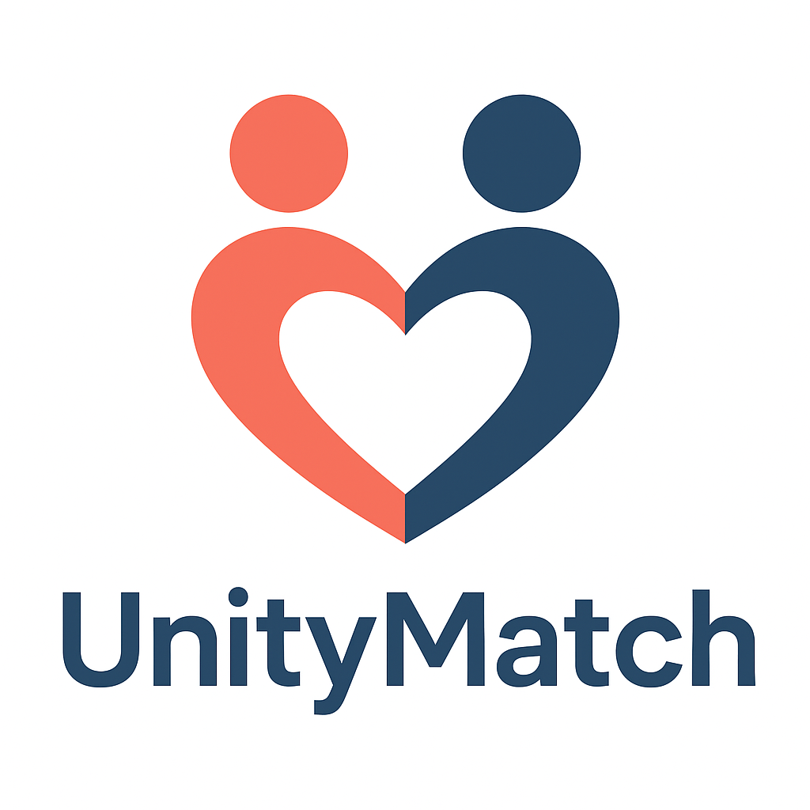
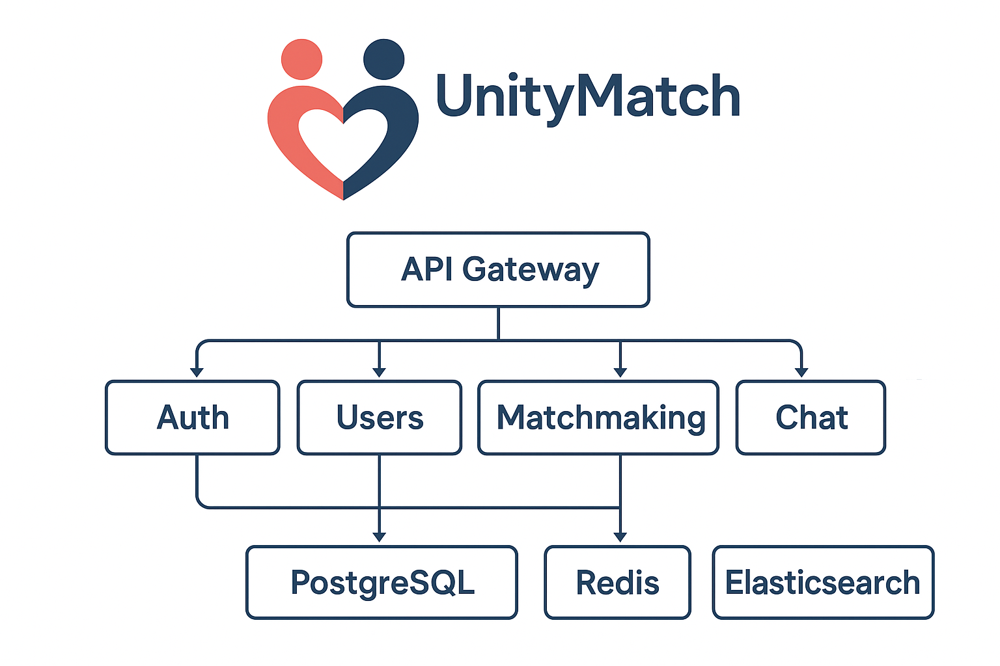

<p align="center">
  
</p>

<h1 align="center">UnityMatch</h1>

<p align="center">
  <em>AI-Powered Matrimonial Platform • Scalable • Secure • Real-Time</em>
</p>

<p align="center">
  <a href="https://github.com/shivompal/unitymatch/stargazers"></a>
  <a href="https://github.com/shivompal/unitymatch/issues"></a>
  <a href="https://github.com/shivompal/unitymatch/blob/main/LICENSE"></a>
  
  
  
</p>

---

## 📖 Overview

**UnityMatch** is a modern, AI-powered matrimonial platform built with a **microservices architecture**.  
It offers **personalized matchmaking**, **real-time chat**, and **advanced search** while ensuring top-notch **security** and **content moderation**.

---

## 🚀 Features

- 🤖 **AI Matchmaking** – Intelligent partner recommendations.
- 📡 **Real-Time Communication** – Chat & notifications via WebSockets.
- 🔍 **Advanced Search** – Elasticsearch for lightning-fast filtering.
- 🛡️ **Content Moderation** – Offensive language detection.
- 📊 **Admin Dashboards** – Analytics, PDF/Excel exports.
- ⚡ **Scalable Microservices** – Modular and independently deployable.

---

## 🛠 Tech Stack

**Backend:** Node.js + TypeScript • Express.js • PostgreSQL • Redis • Elasticsearch • Socket.IO  
**Frontend:** React • Tailwind CSS • Chart.js  
**Infra & Tools:** Docker • GitHub Codespaces • PostgreSQL Stored Procedures • PDF/Excel Export

---

## 🗂 Repository Structure

unitymatch/
├── services/ # All backend microservices
│ ├── auth/ # Authentication service
│ ├── users/ # User profiles
│ ├── matchmaking/ # AI matchmaking logic
│ ├── chat/ # Real-time chat
│ ├── moderation/ # Content moderation
│ └── admin/ # Admin dashboard backend
│
├── frontend/ # React + Tailwind frontend
├── docs/ # Documentation & diagrams
│ └── assets/ # Images (logo, architecture diagram)
├── scripts/ # DevOps scripts
└── README.md

## 🖥️ Architecture Diagram

<p align="center">
  
</p>

## ⚙️ Getting Started

> **Note:** We recommend using **GitHub Codespaces** for an instant cloud development environment.

### 1️⃣ Clone the Repository

```bash
git clone https://github.com/shivompal/unitymatch.git
cd unitymatch

2️⃣ Launch in GitHub Codespaces
Open the repository in GitHub Codespaces – all dependencies will be pre-installed.

3️⃣ Run with Docker
bash

docker-compose up --build
4️⃣ Access the Application
Frontend: http://localhost:3000

API Gateway: http://localhost:8000

📜 License
This project is licensed under the MIT License.

© 2025 UnityMatch • All Rights Reserved
```
